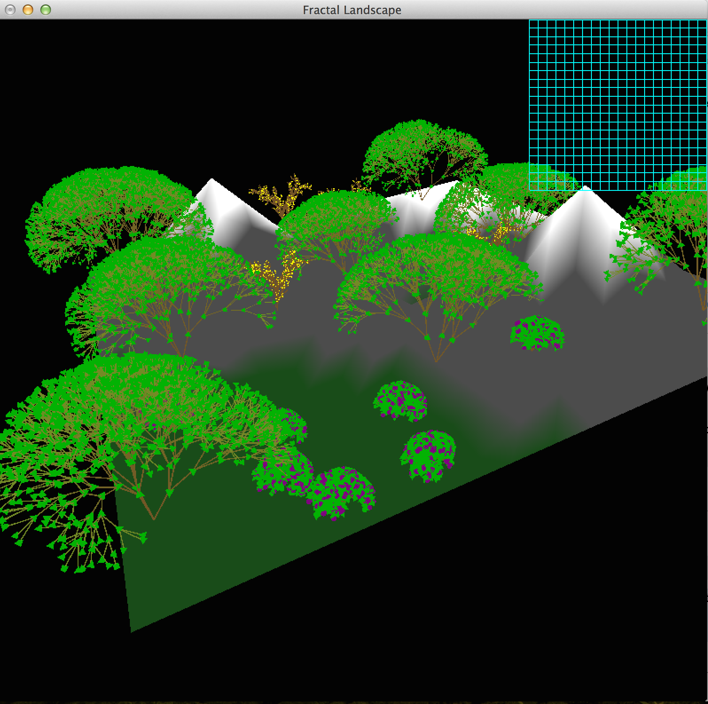
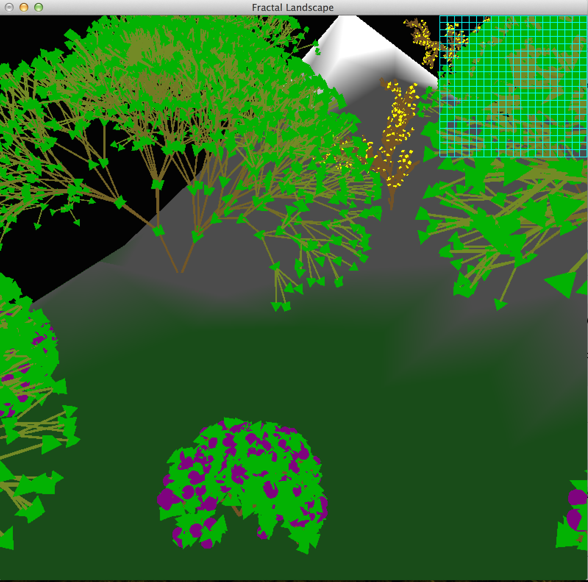
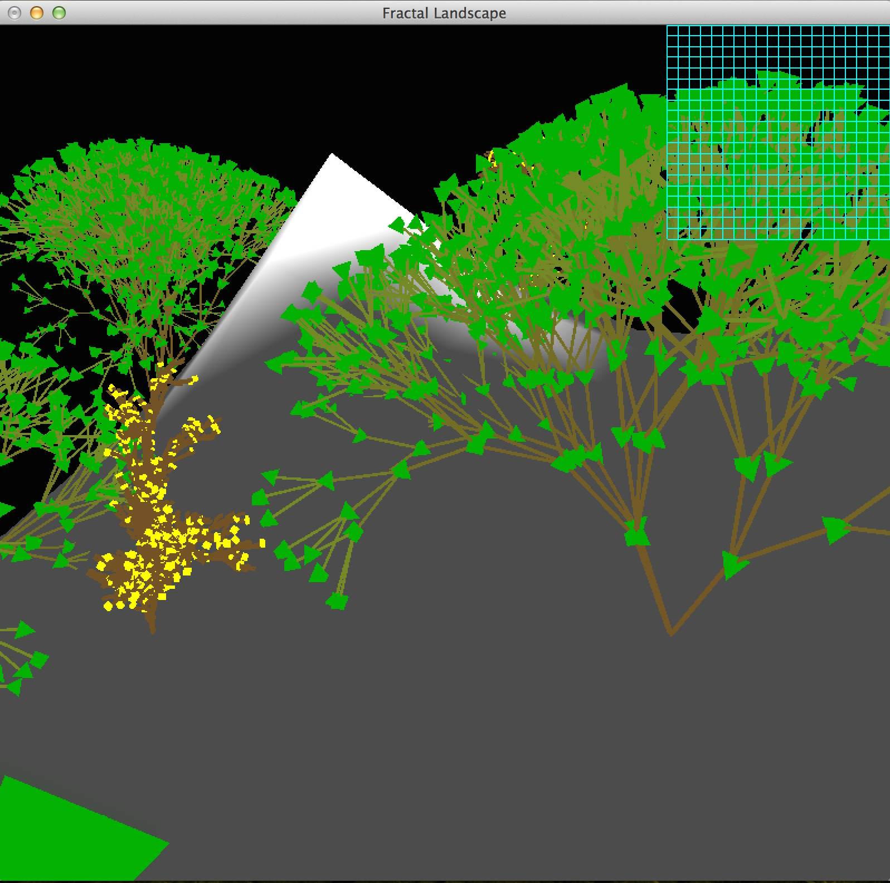

**PLANT Generator: USER GUIDE**
------------------------------------
##### Bryan Jensen and Devin Delfino
=============================

## __Description__
Generate a variety of plants on a landscape scene using the default grammars or custom grammars.

## __Included Files__

* **classes.h** : Header file, containing the prototypes for the various classes used in the program

* **classes.cpp** : Contains functionality for the methods of the classes defined in classes.h

* **landscape.cpp** : Main driver file for C++ program

* **small.dem.grd** : Digital Elevation Model (in ESRI Format) representing a randomly generated, fractal landscape 

* **tree.gram** : Grammar definition to create an instance of a tree

* **bush.gram** : Grammar definition to create an instance of a bush

* **twig.gram** : Grammar definition to create an instance of a flowery twig

* **README.md** : This user guide that includes the description of how to use the program

* **Overview.png** : Overview screenshot of the default scene

* **AllThree.png** : Screenshot of the default scene including all three types of plants

* **CoolView.png** : Another screenshot of the default scene, showcasing the fractal nature of the plants

* **Makefile** : Makefile used to compile the program (compatible with Linux and OS X operating systems)

## __How to Compile__

* To compile the program using the included Makefile, use the command: ` $ make landscape `

* The executable file is named "Delfino_Jensen_G4" and can be run with the command: ` $ ./Delfino_Jensen_G4 `

* To include additional grammar files, include the desired filename during your execute command as additional parameters to the call, shown in the example below (Note: input files must be in the same directory as the executable):` $ ./Delfino_Jensen_G4 <exampleGrammar.gram> `

* The program accepts up to and including 7 custom input files, selectable through the interactive menu (activated via right-clicking)

* If no input file is included, only the three provided grammars will be available

## __Program Controls__
####Keyboard Controls

* **space** - Move camera up
* **x** - Move camera down
* **s | 2** : Move camera backwards
* **w | 8** : Move camera forwards
* **a | 4** : Move camera left
* **d | 6** : Move camera right
* **esc** : Quit Program

####Mouse Controls
* **Left Click (and Hold)** : Pan the camera while moving the mouse with the left button held 
* **Left Click (on Minimap)** : Grow a plant using the current grammar at the indicated location
* **Right Click** : Open menu options

####Menu Options
* **Build Default Scene** : Builds a default scene including all three default types of plants
* **Randomly Place 3 of the Current Plant** : Randomly places 3 instances of the current plant type on the landscape
* **Randomly Place 5 Random Plants** : Randomly places 5 plants, of randomly chosen types, on the landscape
* **Clear the Scene** : Clears the scene of all current plants
* **Choose Grammar (Tree)** : Changes the current grammar to display a tree on left click
* **Choose Grammar (Bush)** : Changes the current grammar to display a bush on left click
* **Choose Grammar (Flower Twig)** : Changes the current grammar to display a flower twig on left click
* **Choose Custom Grammar #** : Changes the current grammar to use designated input file
* **Input Standard Deviation (via the console)** : Prompts the user for a float representing the standard deviation of the rotation angle in the console window. The default value is 5, and the higher the standard deviation, the more 'random' the plant will appear.
* **Quit** : Quits program

## __Input File Format__
* The first line of the input file indicates the order of the plant, meaning how many iterations will it take to generate the plant. This line is made up of a character followed by an integer separated by a space (ex. 'n 6')

* The second line of the input file indicates the rotation angle of the branches. This line is made up of a character followed by a float separated by a space (ex. 'a 22.5')

* The third line of the input file indicates the starting length of a branch. This line consists of a character followed by a float separated by a space (ex. 'l 10')

* The fourth line of the input file indicates the starting plant string. This line consists of a character followed by a string separated by a space (ex. 's A')

* Each production rule consists of a non-terminal symbol, followed by a colon and a string of non-terminal and terminal symbols. This string and the colon must be separated by a space (ex. 'A: BAB' or 'A: G[Y+X+BFA]')

* To include a rotation in the grammar, the symbols combination is a Y (+/-) followed by an X (+/-)  Examples include *'Y+X+'*, *'Y+X-'*, *'Y-X+'*, *'Y-X-'*

* Note: The Y (+/-) MUST come before the X (+/-) 

* For every **[** symbol, there must be a corresponding **]** symbol

## __Valid Grammar Symbols__
* **B** : Creates a branch of the current color and size depending on the current location in the plant
* **L** : Creates a green leaf at the current location in the plant
* **F** : Creates a yellow flower at the current location in the plant
* **E** : Creates a purple berry at the current location in the plant 
* **G** : Increments the green value in the red, green, blue (rgb) color format  
* **g** : Decrements the green value in the red, green, blue (rgb) color format  
* **X** : Indicates a rotation about the X axis
* **Y** : Indicates a rotation about the Y axis
* **+** : Rotates by a random positive angle within the standard deviation of the rotation angle of the plant (rotates about X axis if preceded by X, rotates about Y axis if preceded by Y)
* **-** : Rotates by a random negative angle within the standard deviation of the rotation angle of the plant (rotates about X axis if preceded by X, rotates about Y axis if preceded by Y)
* **[** : Pushes a new section of the plant onto the stack
* **]** : Pops the previous section of the plant from the stack

## __Available Plant Parts__
* **Branch** : A brown branch that will be scaled down in size the higher its location is on the plant
* **Leaf** : A green leaf that remains the same size throughout the plant
* **Flower** : A yellow flower that remains the same size throughout the plant
* **Berry** : A purple berry that remains the same size throughout the plant

## __Sample Input Files__
* **tree.gram**  
n 6  
a 25.0 
L 40 
s A 
A: G[Y+X+BLA][Y+X-BLA][Y-X+BLA][Y-X-BLA]g  
A: G[Y+X+BLA][Y+X-BLA][Y-X+BLA]g  
A: G[Y+X+BLA][Y+X-BLA][Y-X-BLA]g  
A: G[Y+X+BLA][Y-X+BLA][Y-X-BLA]g  
A: G[Y+X-BLA][Y-X+BLA][Y-X-BLA]g  

* **bush.gram**  
n 6  
a 30.0  
L 10  
s A  
A: [Y+X+BLA][Y+X-BLA][Y-X+BLA]  
A: [Y+X+BLA][Y+X-BLA][Y+X-BLA]  
A: [Y+X+BEA][Y+X-BLA][Y-X+BLA]  
A: [Y+X+BLA][Y+X-BEA][Y-X+BLA]  
A: [Y+X+BLA][Y+X-BLA][Y-X+BEA]  

* **twig.gram**  
n 4  
a 22.5  
L 2  
s B  
B: BY+BX-[X-BX+BX+BF]X+[X+BX-BX-B]  
B: BY+BX-[X-BX+BX+B]X+[X+BX-BX-B]  

## __Sample Output__

